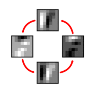
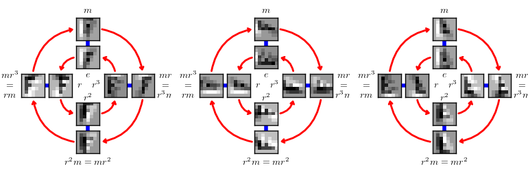

# GrouPy

GrouPy is a python library that implements group equivariant convolutional neural networks [\[Cohen & Welling, 2016\]](#gcnn), and supports other numerical computations involving transformation groups.

GrouPy consists of the following modules:

- garray: an array of transformation variables ("group elements")
- gfunc: an array of functions on a group of transformations
- gconv: group convolutions for use in group equivariant convolutional networks

The modules garray and gfunc are used in a quick precomputation stage and run on CPU, while gconv is used to train and test the neural network, and runs on GPU.

The group convolution has so far only been tested in the Chainer framework, but a (largely untested) tensorflow implementation is available, and the code is written so that porting to theano, torch, or other frameworks is relatively easy. Most of the complexity of the code is in a precomputation step that generates indices used for transforming the filters, and this step can be shared by every deep learning framework. The rest is a basic indexing operation.


## Setup

Install scientific python stack + nosetests
```
$ pip install numpy scipy matplotlib nose
```

Install [chainer](http://chainer.org/) with CUDNN and HDF5: [installation instructions](https://chainer.readthedocs.io/en/stable/install.html). Alternatively, install [tensorflow](https://www.tensorflow.org/) (curently, tensorflow support is limited).

Clone the latest version from github and run setup.py

```
$ python setup.py install
```

To run the tests, navigate to the groupy directory and run

```
$ nosetests -v
```


## Functionality

The following describes the main modules of GrouPy. For usage examples, see the various unit tests.

### garray

The garray module contains a base class GArray as well as subclasses for various groups G. A GArray represents an array (just like numpy.ndarray) that contains transformations instead of scalars. Elementwise multiplication of two GArrays results in an elementwise composition of transformations. The GArray supports most functionality of a numpy.ndarray, including indexing, broadcasting, reshaping, etc.

Each GArray subclass implements the group operation (composition) for the corresponding group, as well as the action of the given group on various spaces (e.g. a rotation acting on points in the plane).

In addition, each GArray may have multiple parameterizations, which is convenient because the composition is typically most easily implemented as a matrix multiplication, while the transformation of a function on the group (see gfunc) requires that we associate each transformation with some number of integer indices.


### gfunc

The gfunc module contains a base class GFuncArray as well as subclasses for various groups G. A GFuncArray is an array of functions on a group G. Like the GArray, this class mimicks the numpy.ndarray.

Additionally, a GFuncArray can be transformed by group elements stored in a GArray. The GFuncArray associates each cell in the array storing the function values with its *coordinate*, which is an element of the group G. When a GFuncArray is transformed, we apply the transformation to the coordinates, and do a lookup in the cells associated with the transformed coordinates, to produce the values of the transformed function.

The transformation behaviour for a function on the rotation-translation group (p4) and the rotation-flip-translation group (p4m) is shown below. This function could represent a feature map or filter in a G-CNN.



A rotating function on p4. Rotating a function on p4 amounts to rolling the 4 patches (in counterclockwise direction). "Rolling" means that each square patch moves to the next one (indicated by the red arrow), while simultaneously undergoing a 90 degree rotation. For visual clarity, the animation contains frames at multiples of 45 degrees, but it should be noted that only rotations by multiples of 90 degrees are part of the group p4. 



A function on p4m, its rotation by 90 degrees, and its vertical reflection. Patches follow the red rotation arrows (while rotating) or the blue mirroring lines (while flipping).

For more details, see section 4.4 of [\[Cohen & Welling, 2016\]](#gcnn).

The gfunc.plot module contains code for plotting the [Cayley](https://en.wikipedia.org/wiki/Cayley_graph)-style graphs shown above.


### Convolution

The gconv module contains group convolution layers for use in neural networks.

The Chainer implementation can be used as follows:

```
from chainer import Variable
import cupy as cp
from groupy.gconv.chainer_gconv import P4ConvZ2, P4ConvP4

# Construct G-Conv layers and copy to GPU
C1 = P4ConvZ2(in_channels=3, out_channels=64, ksize=3, stride=1, pad=1).to_gpu()
C2 = P4ConvP4(in_channels=64, out_channels=64, ksize=3, stride=1, pad=1).to_gpu()

# Create 10 images with 3 channels and 9x9 pixels:
x = Variable(cp.random.randn(10, 3, 9, 9).astype('float32'))

# fprop
y = C2(C1(x))
print y.data.shape  # (10, 64, 4, 9, 9)
```

A first stab at a tensorflow implementation can be found gconv.tensorflow_gconv


## Implementation notes

### Porting to other frameworks

To port the gconv to a new deep learning framework, we must implement two computations:

1. *Filter transformation*: a simple indexing operation (see gconv.chainer_gconv.transform_filter and gconv.tensorflow_gconv.transform_filter)
2. *Planar convolution*: standard convolution using the filters returned by the filter transformation step (see gconv.chainer_gconv.splitgconv2d)

For details, see [\[Cohen & Welling, 2016\]](#gcnn), section 7 "Efficient Implementation".


### Adding new groups

The garray and gfunc modules are written to facilitate easy implementation of the group convolution for new groups.
The group convolution for a new group can be implemented as follows:

1. Subclass GArray for the new group and the corresponding stabilizer (see e.g. garray.C4_array and garray.p4_array) 
2. Subclass GFuncArray for the new group (see e.g. garray.gfunc.p4func_array)
3. Add a function to gconv.make_gconv_indices to precompute the indices used by the group convolution GPU kernel.
4. For the Chainer implementation, subclass gconv.chainer_gconv.splitgconv2d (see e.g. gconv.chainer_gconv.p4_conv)

These subclasses can easily be tested against the group axioms and other mathematical properties (see test_garray, test_gfuncarray, test_transform_filter, test_gconv).


## References

1. <a name="gcnn"></a> T.S. Cohen, M. Welling, [Group Equivariant Convolutional Networks](http://www.jmlr.org/proceedings/papers/v48/cohenc16.pdf). Proceedings of the International Conference on Machine Learning (ICML), 2016.